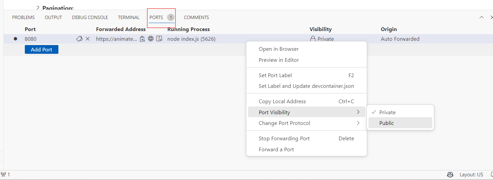

# Building a Movie Frontend with Copilot

Welcome to the Copilot Lab Movie API! Our goal is to create a frontend application that interacts with a backend API specifically designed to provide movie-related information.

### Main Feature

The primary functionality of the Frontend is to **display a list of movies**. Users will be able to view relevant details about each movie.

### Optional Enhancements

1. **Styling the Movie List:**

   - You can style the movie list using either plain CSS or a popular CSS framework (such as Material or Bootstrap).

   - This customization allows for a visually appealing presentation of movie information.

2. **Pagination:**

   - Implementing pagination enables users to navigate through the movie list efficiently.

   - By breaking down the list into smaller chunks, users can explore movies without overwhelming the interface.

### Final Result

Check out the **FrontDemo.gif** file to see the end result of our frontend. It demonstrates how movie information is presented to users.

### Important

1. When using the **ng new command**, you must include the following option **--standalone false** to specify that you want a project structure with module.

2. If you encounter a **CORS** issue while fetching data from the API using **Codespace in a browser**, follow these steps (ensure the server is running):

   -  Open a new Codespace terminal and run the following command:

   `gh codespace ports visibility 8080:public -c $CODESPACE_NAME`

   - Alternatively, follow the step shown in the image below:

   

3. URLs for the images :

   - Original size : https://image.tmdb.org/t/p/original

   - Thumbnail size : https://image.tmdb.org/t/p/w500

### Feeling Stuck?

You can find just bellow some steps to guide you through the lab. Additionally, if you require further help, the **README-with-steps-and-commands** file provides detailed examples of Copilot prompts.

Happy coding! 🚀

--------------------------------------

# Lab STEPS

## Backend

These instructions will get you a copy of the project up and running on your local machine.

1. Open the backend folder, used Copilot to explain the code.

2. Install the dependencies and start the server.

3. Open your browser and access the API documentation.

4. Make some requests.

## Frontend

### Installing Angular

1. Ask Copilot how to install Angular.

2. Follow the steps to create an Angular project.

   - For the **ng new command**, you must include the following option **--standalone false** to specify that you want a project structure with module.

   - We recommend using the **SCSS** style.

3. Run the project and open the browser at the specified URL.

   - In your browser open the console and keep it open.

### Displaying the List of Movies

1. Generate interfaces or types based on the backend response.

2. Ask Copilot how to get the list of movies from the API.

3. Ask Copilot how to generate the MovieService.

4. Ask Copilot how to generate the MovieListComponent.

5. Ask Copilot how to display the list of movies.

6. Verify that the list of movies is displayed.

7. Ask Copilot why the list of movies is not displayed.

### Styling the List of Movies

It's your turn 😉

### Pagination of Movies

It's your turn 😉
